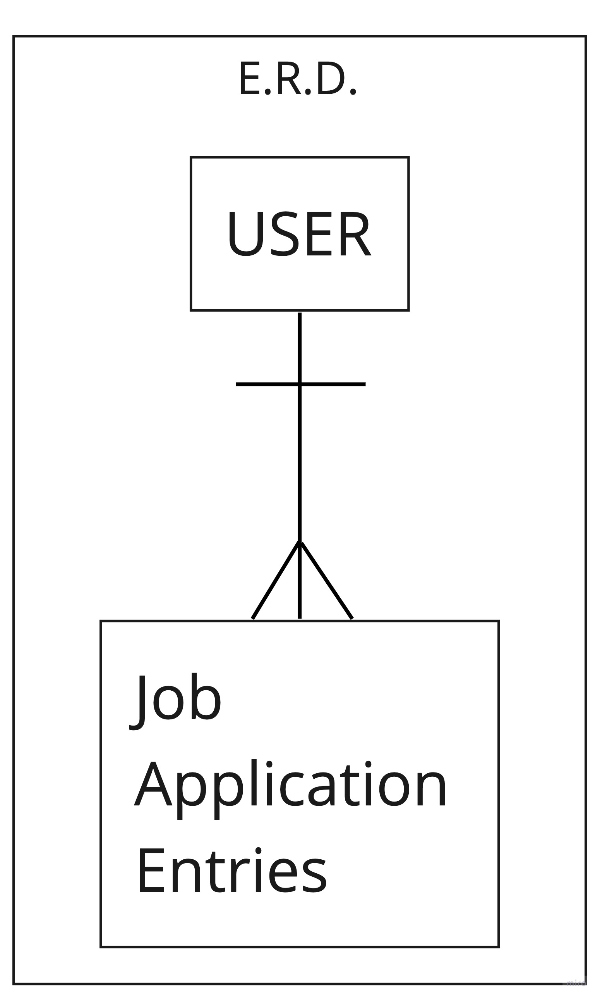

# AppTrack API

AppTrack is a tool I built to help keep track of my job search and the applications I've turned in. It helps the user stay on track, ensuring that they keep in touch with prospctive job opportunities.

## Technologies Used
- Python
- Django/Django REST framework
- PostgreSQL
- Heroku

## ERD

## Organization

- Designed ERD, Wireframes and user stories.
- Set up and tested API user routes.
- Setup and tested API resource routes.
- Front end component builds.
- Testing Axios API communication.
- Debug and styling
- Deployment to GitHub and Heroku

## Routes
| METHOD | Endpoint   | #Action        | AuthenticatedRoute? |
|--------|------------|----------------|---------------------|
| POST   | sign-up/   | users#signup   | No                  |
| POST   | sign-in/   | users#signin   | No                  |
| PATCH  | change-pw/ | users#changepw | Yes                 |
| DELETE | sign-out/  | users#signout  | Yes                 |

| METHOD | Endpoint          | #Action            | AuthenticatedRoute? |
|--------|-------------------|--------------------|---------------------|
| GET    | /                 | users#landing      | No                  |
| GET    | entries/          | users#indexentries | Yes                 |
| POST   | entries/          | users#createentry  | Yes                 |
| GET    | entries/< int:pk >/ | users#showentry    | Yes                 |
| PATCH  | entries/< int:pk >/ | user#updatenetry   | Yes                 |
| DELETE | entries/< int:pk >/ | user#deleteentry   | Yes                 |

## Setup and Installation
*Versions:*
- Django 3.0
- Python 3.7
- Requires gunicorn package
- See *pipfile* for further dependencies.

## Future Updates

AppTrack is currently in a very alpha version, my plan is to completely expand features relating to adding, deleting, updating and viewing entries, some other tools will be added to help in the search.
